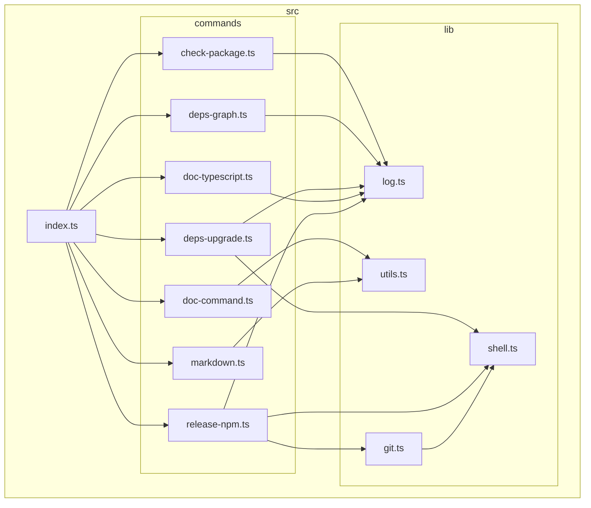

[](https://codecov.io/gh/versatiles-org/node-release-tool)
[](https://github.com/versatiles-org/node-release-tool/actions/workflows/ci.yml)

# VersaTiles Release Tools

Tools used for:

* creating a graph of the source code as mermaid: [`vrt deps-graph`](#subcommand-vrt-deps-graph)
* upgrading all package dependencies: [`vrt deps-upgrade`](#subcommand-vrt-deps-upgrade)
* creating Markdown documentation of executables: [`vrt doc-command`](#subcommand-vrt-doc-command)
* inserting Markdown into documents: [`vrt doc-insert`](#subcommand-vrt-doc-insert)
* updating "Table of Content" in Markdown files: [`vrt doc-toc`](#subcommand-vrt-doc-toc)
* releasing the project as npm package: [`vrt release-npm`](#subcommand-vrt-release-npm)

# Installation

```bash
npm i -D @versatiles/release-tool
```

# configure scripts

You need to configure the scripts in the package.json:

```JSON
{
  "scripts": {
    "check": "npm run lint && npm run build && npm run test",
    "prepack": "npm run build && npm run doc",
    "release": "vrt release-npm",
    ...
  },
  ...
}
```

* `scripts.check` is **required** by the release command. Here you can lint, build and test your code.
* `scripts.prepack` is **recommended** to ensure that all files are up-to-date before releasing. Here you can build code and documentation.
* `scripts.release` is **recommended** to make it easy to release a new version.

# Command `vrt`

<!--- This chapter is generated automatically --->

```console
$ vrt
Usage: vrt [options] [command]

versatiles release and documentaion tool

Options:
  -h, --help                                display help for command

Commands:
  check-package                             checks the package.json for required scripts
  deps-graph                                draws a graph of all files in the project and outputs it as mermaid
  deps-upgrade                              upgrades all dependencies to the latest version
  doc-command <command>                     documents a runnable command and outputs it
  doc-insert <readme> [heading] [foldable]  takes Markdown from stdin and insert it into a Markdown file
  doc-toc <readme> [heading]                updates the TOC in a Markdown file
  doc-typescript [options]                  generates a documentation for a TypeScript project
  release-npm [path]                        releases a npm package
  help [command]                            display help for command
```

## Subcommand: `vrt check-package`

```console
$ vrt check-package
Usage: vrt check-package [options]

checks the package.json for required scripts

Options:
  -h, --help  display help for command
```

## Subcommand: `vrt deps-graph`

```console
$ vrt deps-graph
Usage: vrt deps-graph [options]

draws a graph of all files in the project and outputs it as mermaid

Options:
  -h, --help  display help for command
```

## Subcommand: `vrt deps-upgrade`

```console
$ vrt deps-upgrade
Usage: vrt deps-upgrade [options]

upgrades all dependencies to the latest version

Options:
  -h, --help  display help for command
```

## Subcommand: `vrt doc-command`

```console
$ vrt doc-command
Usage: vrt doc-command [options] <command>

documents a runnable command and outputs it

Arguments:
  command     command to run

Options:
  -h, --help  display help for command
```

## Subcommand: `vrt doc-insert`

```console
$ vrt doc-insert
Usage: vrt doc-insert [options] <readme> [heading] [foldable]

takes Markdown from stdin and insert it into a Markdown file

Arguments:
  readme      Markdown file, like a readme.md
  heading     Heading in the Markdown file (default: "# API")
  foldable    Make content foldable (default: false)

Options:
  -h, --help  display help for command
```

## Subcommand: `vrt doc-toc`

```console
$ vrt doc-toc
Usage: vrt doc-toc [options] <readme> [heading]

updates the TOC in a Markdown file

Arguments:
  readme      Markdown file, like a readme.md
  heading     Heading in the Markdown file (default: "# Table of Content")

Options:
  -h, --help  display help for command
```

## Subcommand: `vrt doc-typescript`

```console
$ vrt doc-typescript
Usage: vrt doc-typescript [options]

generates a documentation for a TypeScript project

Options:
  -i <entryPoint>  entry point of the TypeScript project, default is
                   "./src/index.ts"
  -o <outputPath>  output path for the documentation, default is "./docs"
  -h, --help       display help for command
```

## Subcommand: `vrt release-npm`

```console
$ vrt release-npm
Usage: vrt release-npm [options] [path]

releases a npm package

Arguments:
  path        root path of the Node.js project

Options:
  -h, --help  display help for command
```

# Development

## Dependency Graph

<!--- This chapter is generated automatically --->


