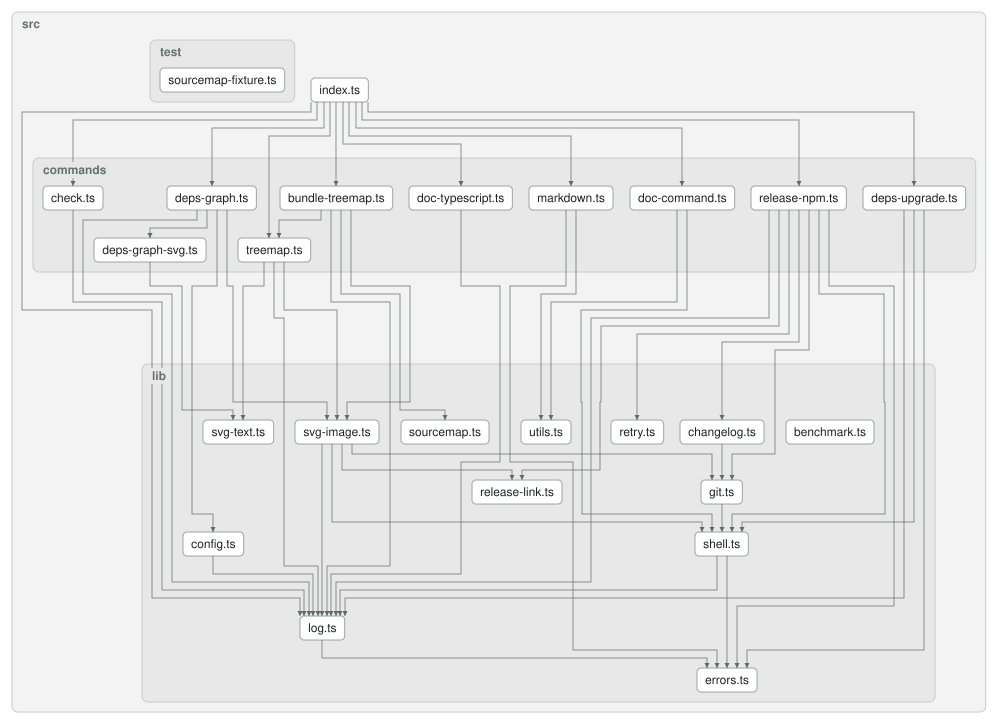

[](https://www.npmjs.com/package/@versatiles/release-tool)
[](https://www.npmjs.com/package/@versatiles/release-tool)
[](https://codecov.io/gh/versatiles-org/node-release-tool)
[](https://github.com/versatiles-org/node-release-tool/actions/workflows/ci.yml)
[](LICENSE)

# VersaTiles Release Tools

Tools used for:

- creating a graph of the source code as mermaid: [`vrt deps-graph`](#subcommand-vrt-deps-graph)
- upgrading all package dependencies: [`vrt deps-upgrade`](#subcommand-vrt-deps-upgrade)
- creating Markdown documentation of executables: [`vrt doc-command`](#subcommand-vrt-doc-command)
- inserting Markdown into documents: [`vrt doc-insert`](#subcommand-vrt-doc-insert)
- updating "Table of Content" in Markdown files: [`vrt doc-toc`](#subcommand-vrt-doc-toc)
- releasing the project as npm package: [`vrt release-npm`](#subcommand-vrt-release-npm)

# Installation

```bash
npm i -D @versatiles/release-tool
```

# configure scripts

You need to configure the scripts in the package.json:

```JSON
{
  "scripts": {
    "check": "npm run lint && npm run build && npm run test",
    "prepack": "npm run build && npm run doc",
    "release": "vrt release-npm",
    ...
  },
  ...
}
```

- `scripts.check` is **required** by the release command. Here you can lint, build and test your code.
- `scripts.prepack` is **recommended** to ensure that all files are up-to-date before releasing. Here you can build code and documentation.
- `scripts.release` is **recommended** to make it easy to release a new version.

# Holding back dependencies

By default `deps-upgrade` upgrades every dependency to its latest version. Dependencies that must not follow can be declared in the `vrt.depsUpgrade.ignore` field of your package.json:

```JSON
{
  "vrt": {
    "depsUpgrade": {
      "ignore": ["path-to-regexp@<7.0.0", "typescript"]
    }
  }
}
```

- An entry without a range (`"typescript"`) blocks every upgrade of that package.
- An entry with a semver range (`"path-to-regexp@<7.0.0"`) only blocks versions outside that range, so patches and minor releases keep coming in. Such a package is upgraded within the range that is already declared in your package.json, e.g. `"^6.3.0"` is upgraded to the latest `6.x`.

The same rules can be given as an object, and on the command line:

```JSON
"ignore": { "path-to-regexp": "<7.0.0", "typescript": true }
```

```bash
vrt deps-upgrade --ignore 'path-to-regexp@<7.0.0' --ignore typescript
```

Command line entries are merged into the configured ones and win in case of a conflict.

# Trimming a noisy dependency graph

For repos with high fan-out, `deps-graph` accepts repeatable globs to collapse or drop nodes:

```bash
# Merge all region scrapers into a single labelled node ("regions/*.ts (24 files)").
vrt deps-graph --collapse-dir 'src/regions/*.ts'

# Drop trivial barrels and stubs from the graph entirely.
vrt deps-graph --exclude '**/_planned.ts' --exclude '**/index.ts'

# Lay out the files of selected directories left-to-right (TB, BT, LR or RL).
vrt deps-graph --subgraph-direction 'src/lib=LR' --subgraph-direction 'src/commands=RL'

# Replace edges from several files in src/commands/ to the same target with one edge from the directory.
vrt deps-graph --merge-outgoing 'src/commands'
```

Instead of passing long lists of flags, you can put the options into a `vrt.config.json` in your project directory. The keys are the flag names; CLI flags are added to these values:

```JSON
{
  "deps-graph": {
    "collapse-dir": ["src/themes/*", "src/omt/layers/*"],
    "exclude": ["**/_planned.ts"],
    "merge-outgoing": ["src/*"],
    "subgraph-direction": ["src/lib=LR"]
  }
}
```

The `svg` option (see below) can be set there too, as a string: `"svg": "docs/dependency-graph.svg"`.

# Dependency graph as SVG

GitHub renders Mermaid without the ELK layout, and npmjs.com doesn't render Mermaid at all. With `--svg`, `deps-graph` lays out the graph with ELK, writes it as an SVG file and prints a Markdown image link instead of Mermaid markup:

```bash
vrt deps-graph --svg docs/dependency-graph.svg | vrt doc-insert README.md '## Dependency Graph'
```

The link is relative (``), so GitHub always shows the graph of the current commit. The SVG adapts to light and dark mode.

On npmjs.com, a README must show the graph of its own version, even after the file changes in later commits. `vrt release-npm` takes care of that:

1. It runs `npm publish` with the environment variable `VRT_RELEASE_VERSION` set to the new version. When `prepack` regenerates the docs, `deps-graph` prints a link to the file at the release tag instead, e.g. `https://raw.githubusercontent.com/<owner>/<repo>/v1.2.3/docs/dependency-graph.svg`. The published package contains this link.
2. After publishing, it turns these links in all changed Markdown files back into relative links, then commits and creates the tag. Existing tags are never overwritten, so a linked file can't change later.

This requires a public GitHub repository in the `repository` field of package.json, and a `prepack` script that regenerates the README (e.g. `npm run build`, which runs `npm run doc`). `--subgraph-direction` is not supported for SVG output.

# Command `vrt`

<!--- This chapter is generated automatically --->

```console
$ vrt
Usage: vrt [options] [command]

CLI tool for releasing packages and generating documentation for
Node.js/TypeScript projects.

Options:
  -h, --help                                display help for command
  -v, --verbose                             Enable verbose output

Commands:
  check                                     Check repo for required scripts and other stuff.
  deps-graph [options]                      Analyze project files and output a dependency graph as Mermaid markup.
  deps-upgrade [options]                    Upgrade all dependencies in the current project to their latest versions.
  doc-command <command>                     Generate Markdown documentation for a specified command and output the result.
  doc-insert <readme> [heading] [foldable]  Insert Markdown from stdin into a specified section of a Markdown file.
  doc-toc <readme> [heading]                Generate a Table of Contents (TOC) in a Markdown file.
  doc-typescript [options]                  Generate documentation for a TypeScript project.
  help [command]                            display help for command
  release-npm [options] [path]              Publish an npm package from the specified path to the npm registry.
```

## Subcommand: `vrt check`

```console
$ vrt check
Usage: vrt check [options]

Check repo for required scripts and other stuff.

Options:
  -h, --help  display help for command
```

## Subcommand: `vrt deps-graph`

```console
$ vrt deps-graph
Usage: vrt deps-graph [options]

Analyze project files and output a dependency graph as Mermaid markup.

Options:
  --collapse-dir <glob>            Collapse all files matching the glob into a
                                   single node (repeatable). (default: [])
  --exclude <glob>                 Drop files matching the glob from the graph
                                   entirely (repeatable). (default: [])
  -h, --help                       display help for command
  --merge-outgoing <glob>          Merge edges from files in directories
                                   matching the glob that point to the same
                                   target into one edge from the directory
                                   (repeatable). (default: [])
  --subgraph-direction <glob=dir>  Set the flow direction (TB, BT, LR, RL) of
                                   directory subgraphs matching the glob, e.g.
                                   "src/lib=LR" (repeatable). (default: [])
  --svg <file>                     Write the graph as SVG to the file and output
                                   a Markdown image link to it instead of
                                   Mermaid markup.

All options can also be set in vrt.config.json, e.g.:
  { "deps-graph": { "merge-outgoing": ["src/*"] } }
CLI options are added to the values from vrt.config.json.
```

## Subcommand: `vrt deps-upgrade`

```console
$ vrt deps-upgrade
Usage: vrt deps-upgrade [options]

Upgrade all dependencies in the current project to their latest versions.

Options:
  -h, --help                  display help for command
  --ignore <package[@range]>  Do not upgrade this dependency, optionally only up
                              to a semver range, e.g. "path-to-regexp@<7.0.0"
                              (repeatable). (default: [])
  --no-peer                   Upgrade to the latest version even when a peer
                              dependency of another package does not allow it.
```

## Subcommand: `vrt doc-command`

```console
$ vrt doc-command
Usage: vrt doc-command [options] <command>

Generate Markdown documentation for a specified command and output the result.

Arguments:
  command     Command to document (e.g., "npm run build").

Options:
  -h, --help  display help for command
```

## Subcommand: `vrt doc-insert`

```console
$ vrt doc-insert
Usage: vrt doc-insert [options] <readme> [heading] [foldable]

Insert Markdown from stdin into a specified section of a Markdown file.

Arguments:
  readme      Path to the target Markdown file (e.g., README.md).
  heading     Heading in the Markdown file where content should be placed.
              Default is "# API". (default: "# API")
  foldable    Whether to wrap the inserted content in a foldable section.
              (default: false)

Options:
  -h, --help  display help for command
```

## Subcommand: `vrt doc-toc`

```console
$ vrt doc-toc
Usage: vrt doc-toc [options] <readme> [heading]

Generate a Table of Contents (TOC) in a Markdown file.

Arguments:
  readme      Path to the Markdown file (e.g., README.md).
  heading     Heading in the Markdown file where TOC should be inserted. Default
              is "# Table of Content". (default: "# Table of Content")

Options:
  -h, --help  display help for command
```

## Subcommand: `vrt doc-typescript`

```console
$ vrt doc-typescript
Usage: vrt doc-typescript [options]

Generate documentation for a TypeScript project.

Options:
  -f, --format <format>      Allowed are "markdown", "wiki" and "html". Default
                             is "markdown".
  -h, --help                 display help for command
  -i, --input <entryPoint>   Entry point of the TypeScript project. Default is
                             "./src/index.ts".
  -o, --output <outputPath>  Output path for the generated documentation.
                             Default is "./docs".
```

## Subcommand: `vrt release-npm`

```console
$ vrt release-npm
Usage: vrt release-npm [options] [path]

Publish an npm package from the specified path to the npm registry.

Arguments:
  path                  Root path of the Node.js project. Defaults to the
                        current directory.

Options:
  -b, --bump <version>  Version to release: "major", "minor", "patch" or an
                        explicit "x.y.z". Skips the prompt, e.g. for CI.
  -h, --help            display help for command
  -n, --dry-run         Show what would be done without making any changes
```

# Development

## Dependency Graph

<!--- This chapter is generated automatically --->


